<div align="center">
  <table border="1">
    <tr>
      <td align="center" style="padding: 20px;">
        <h3>📢 Domain & Email Migration Notice</h3>
        <p>Since <b>13 March 2026</b>, FitFlo has transitioned to new domains as <code>fitflo.site</code> was not renewed:</p>
        <p>🌐 <b>Website:</b> <a href="https://fitflo.faizath.com">fitflo.faizath.com</a> (formerly <i>fitflo.site</i>)<br>
        ⚙️ <b>API:</b> <a href="https://fitflo-api.faizath.com">fitflo-api.faizath.com</a> (formerly <i>api.fitflo.site</i>)<br>
        📧 <b>Email:</b> <code>contact@fitflo.faizath.com</code> (formerly <i>@fitflo.site</i>)</p>
      </td>
    </tr>
  </table>
</div>

<!-- PROJECT LOGO -->
<br />
<div align="center">
  <a href="https://fitflo.faizath.com/">
    
  </a>

  <h1 align="center">FitFlo</h1>

  <p align="center">
    <strong>AI-Powered Healthcare Pathway Planner for Value-Based Care</strong>
    <br />
    Submitted for <strong>HealthHack 2025</strong> by National University of Singapore
    <br />
    <br />
    <a href="https://fitflo.faizath.com/">View Demo</a>
    ·
    <a href="https://github.com/FitFlo-App/FitFlo-BE/issues">Report Bug</a>
    ·
    <a href="https://github.com/FitFlo-App/FitFlo-BE/issues">Request Feature</a>
  </p>

  [![MIT License][license-shield]][license-url]
  [![Node.js][node-shield]][node-url]
  [![Express][express-shield]][express-url]
  [![MongoDB][mongodb-shield]][mongodb-url]
  [![InterSystems IRIS][iris-shield]][iris-url]
  [![Redis][redis-shield]][redis-url]

</div>

---

## 🌟 About FitFlo

**FitFlo** is an AI-driven healthcare pathway planner designed to revolutionize the patient journey by aligning with the principles of **Value-Based Healthcare**. Developed for **HealthHack 2025** (Theme 1), FitFlo shifts the focus from the volume of services to the *value* of care delivered, empowering patients with personalized, data-driven health insights.

### 🎯 The Challenge: Value-Based Healthcare
Value-based healthcare emphasizes improving patient outcomes while reducing costs. Modern healthcare faces challenges in tracking outcomes across different care settings and maintaining quality while managing expenses.

### 💡 Our Solution
FitFlo leverages AI and real-time data analytics to:
1.  **Track & Improve Outcomes:** Interactive treatment pathways and real-time monitoring ensure patients stay on the optimal path to recovery.
2.  **Reduce Costs:** By providing AI-driven recommendations and efficient pathway planning, we minimize unnecessary procedures and administrative overhead.

---

## 🚀 Live Links & Repositories

| Component | Repository | Deployment |
| :--- | :--- | :--- |
| **Frontend** | [GitHub Repo](https://github.com/FitFlo-App/FitFlo-FE) | [fitflo.faizath.com](https://fitflo.faizath.com/) |
| **Backend** | [GitHub Repo](https://github.com/FitFlo-App/FitFlo-BE) | [fitflo-api.faizath.com](https://fitflo-api.faizath.com/) |

---

## 🛠 Tech Stack

### Frontend
- **Core:** [React 18](https://reactjs.org/), [TypeScript](https://www.typescriptlang.org/), [Vite](https://vitejs.dev/)
- **UI Frameworks:** [Hero UI](https://heroui.com/), [Ant Design](https://ant.design/), [Shadcn UI](https://ui.shadcn.com/)
- **Styling:** [Tailwind CSS](https://tailwindcss.com/), [Framer Motion](https://www.framer.com/motion/)
- **Visualizations:** [React Flow / XYFlow](https://reactflow.dev/) (Interactive Pathways), [Recharts](https://recharts.org/) (Health Analytics)
- **Icons:** [Lucide React](https://lucide.dev/), [Tabler Icons](https://tabler-icons.io/)

### Backend
- **Core:** [Node.js](https://nodejs.org/), [Express](https://expressjs.com/)
- **Database:** **InterSystems IRIS** (High-performance health data), [MongoDB](https://www.mongodb.com/) (Mongoose), [Redis](https://redis.io/)
- **AI/ML:** [@xenova/transformers](https://huggingface.co/docs/transformers.js/), [Natural](https://github.com/NaturalNode/natural)
- **Auth:** [Passport.js](https://www.passportjs.org/) (Google OAuth), [JWT](https://jwt.io/)

### IRIS Intersystems

IRIS Intersystems is used to store and query vectorized symptom data to predict user disease from a chat. Then, FitFlo will give user General Advice, Medication, Home Remedies, and Alteranative Treatments.

<p align="center">
  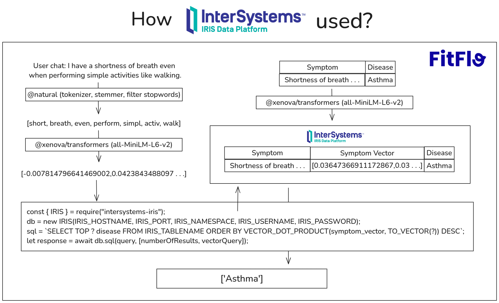
  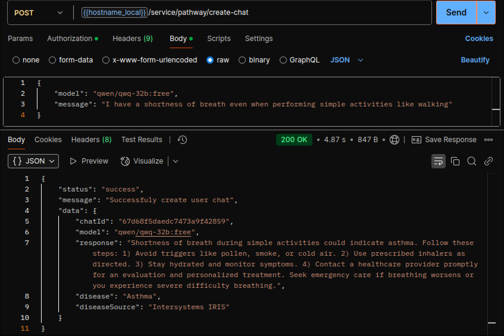
</p>

#### Problems with IRIS Intersystems

While Intersystems IRIS Community Edition performs reliably in a local Docker environment, its stability in a VPS-hosted Docker setup is highly questionable for production use. The instance frequently stops running without clear explanations, making it unpredictable and frustrating to maintain. Occasionally, it cites "License limit exceeded 1 times since instance start," but more often than not, it fails without providing any reason at all. This inconsistency makes it unreliable for critical workloads, as troubleshooting becomes a guessing game. For a production environment, a database system should offer transparency and stability, two qualities that IRIS Community Edition currently lacks in a VPS-hosted Docker setup.

---

## 📸 Screenshots

<p align="center">
  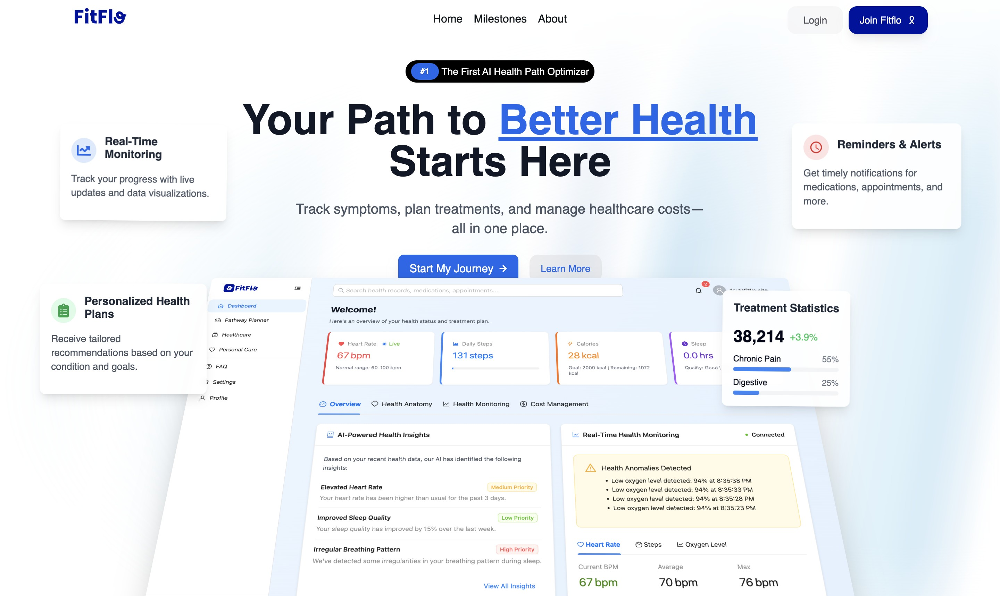
  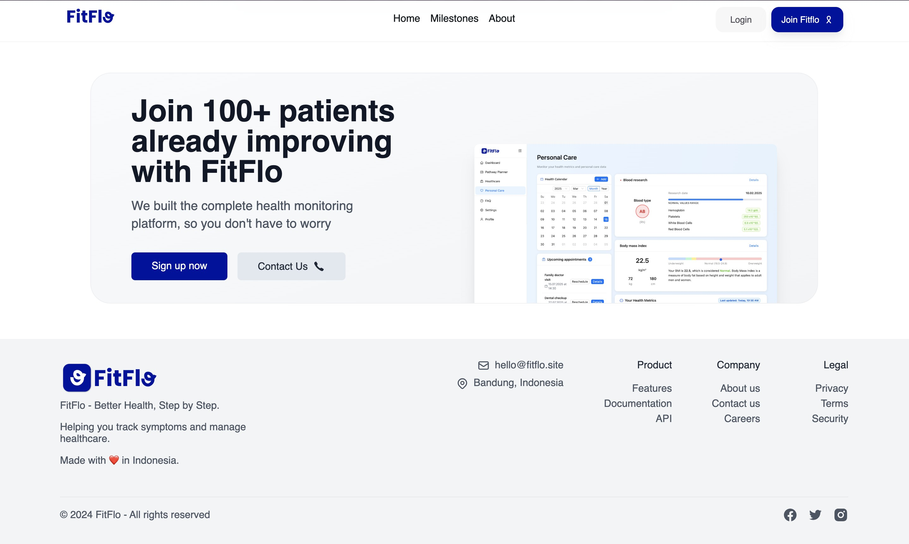
  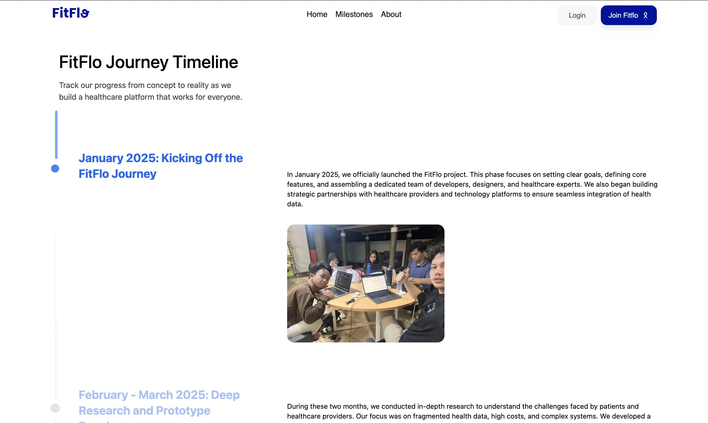
  <br />
  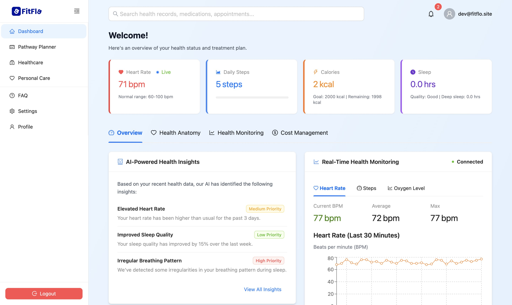
  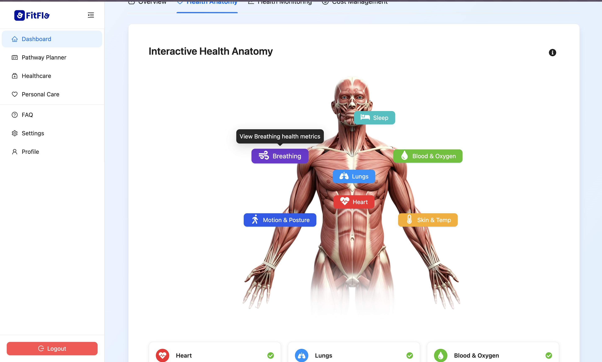
  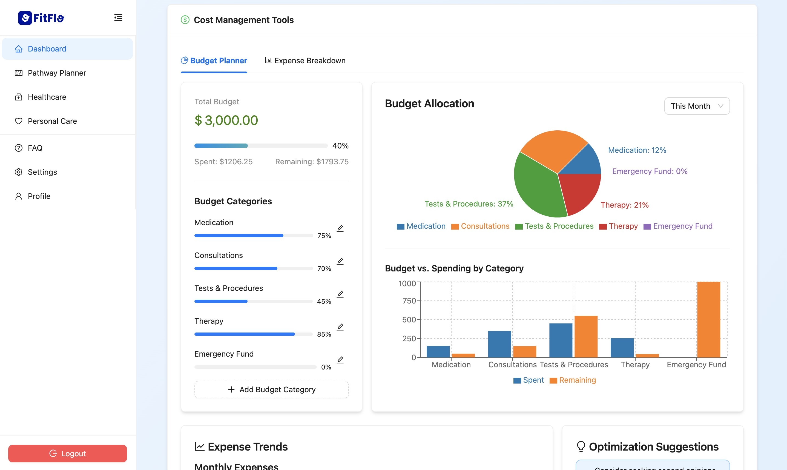
  <br />
  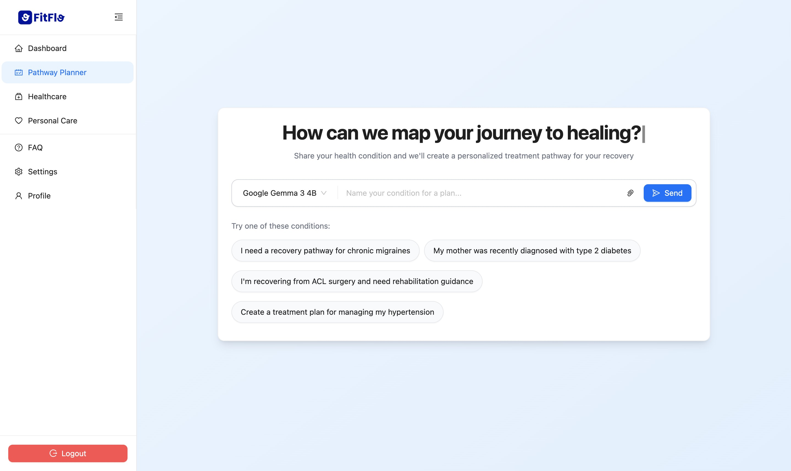
  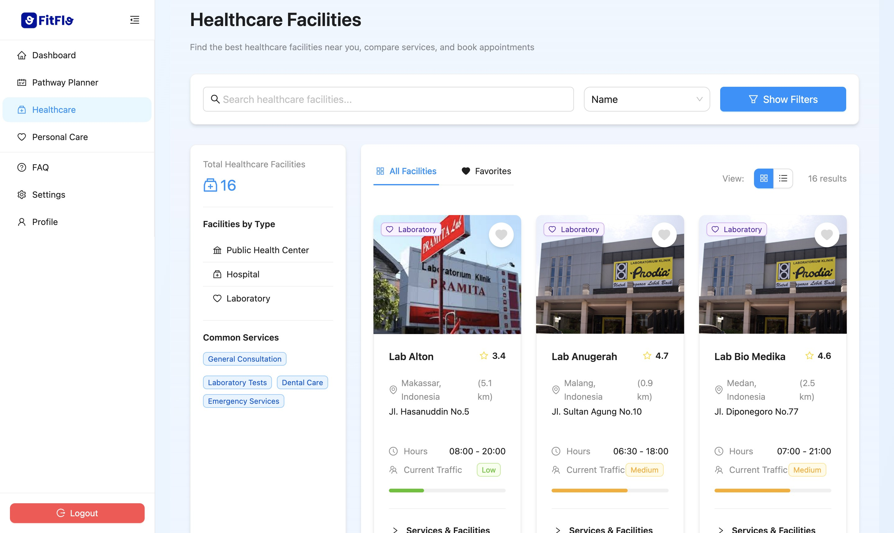
  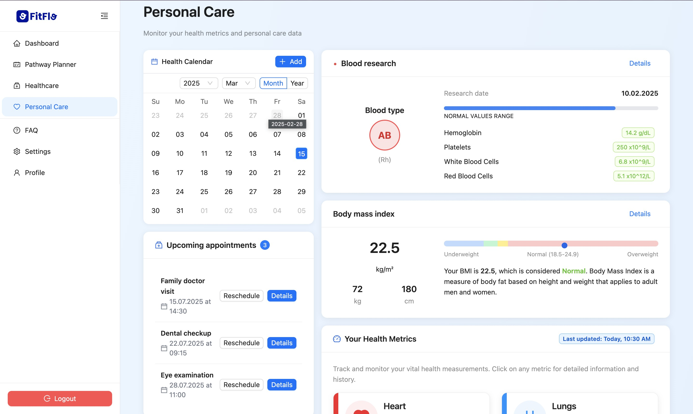
</p>

---

## 👥 Meet the Team

**Created by ITB Team:**

- **Andhita Naura H.**
- **Aththriq Lisan Q. D. S.**
- **Eleanor Cordelia**
- **Marzuli Suhada M**
- **Muhammad Faiz A**

---

## ⚙️ Getting Started

### Installation
To set up the backend locally:

1. Clone the repository:
   ```sh
   git clone https://github.com/FitFlo-App/FitFlo-BE.git
   cd FitFlo-BE
   ```

2. Create a `.env` file and configure environment variables.

3. To start development server:
   ```sh
   npm run dev
   ```

4. To build Docker image and start the containers:
   ```sh
   docker-compose up --build -d
   ```

5. Verify that the containers are running:
   ```sh
   docker ps
   ```

## API Endpoints

### Authentication
| Endpoint                     | Method | Description |
|------------------------------|--------|-------------|
| `/user/auth/email/login`     | POST   | Login with email |
| `/user/auth/email/register`  | POST   | Register a new user |
| `/user/auth/refresh-token`   | GET    | Refresh authentication token |
| `/user/auth/email/verify`    | POST   | Send email verification |
| `/user/auth/email/activation?token=...` | GET | Verify email activation |
| `/user/auth/email/forgot-password` | POST | Request password reset |
| `/user/auth/email/change-password` | PUT | Change user password |

### User Profile
| Endpoint                     | Method | Description |
|------------------------------|--------|-------------|
| `/user/profile/create`       | POST   | Create user profile |
| `/user/profile/update`       | PUT    | Update user profile |
| `/user/profile/read`         | GET    | Get user profile details |

### AI Chat & Pathway Planner
| Endpoint                     | Method | Description |
|------------------------------|--------|-------------|
| `/service/pathway/create-chat` | POST | Start a chat with AI for pathway planning |
| `/service/pathway/continue-chat` | PUT | Continue started chat with AI for pathway planning |
| `/service/pathway/read-chat` | GET | Read started chat with AI for pathway planning |

---

## 📜 License
Distributed under the MIT License. See `LICENSE` for more information.

---
<p align="center">Built with ❤️ for HealthHack 2025</p>

<!-- MARKDOWN LINKS & IMAGES -->
[license-shield]: https://img.shields.io/github/license/FitFlo-App/FitFlo-BE.svg?style=for-the-badge
[license-url]: https://github.com/FitFlo-App/FitFlo-BE/blob/main/LICENSE
[node-shield]: https://img.shields.io/badge/Node.js-339933?style=for-the-badge&logo=nodedotjs&logoColor=white
[node-url]: https://nodejs.org/
[express-shield]: https://img.shields.io/badge/Express.js-000000?style=for-the-badge&logo=express&logoColor=white
[express-url]: https://expressjs.com/
[mongodb-shield]: https://img.shields.io/badge/MongoDB-47A248?style=for-the-badge&logo=mongodb&logoColor=white
[mongodb-url]: https://www.mongodb.com/
[iris-shield]: https://img.shields.io/badge/InterSystems_IRIS-005F9E?style=for-the-badge&logo=intersystems&logoColor=white
[iris-url]: https://www.intersystems.com/products/intersystems-iris/
[redis-shield]: https://img.shields.io/badge/Redis-DC382D?style=for-the-badge&logo=redis&logoColor=white
[redis-url]: https://redis.io/
